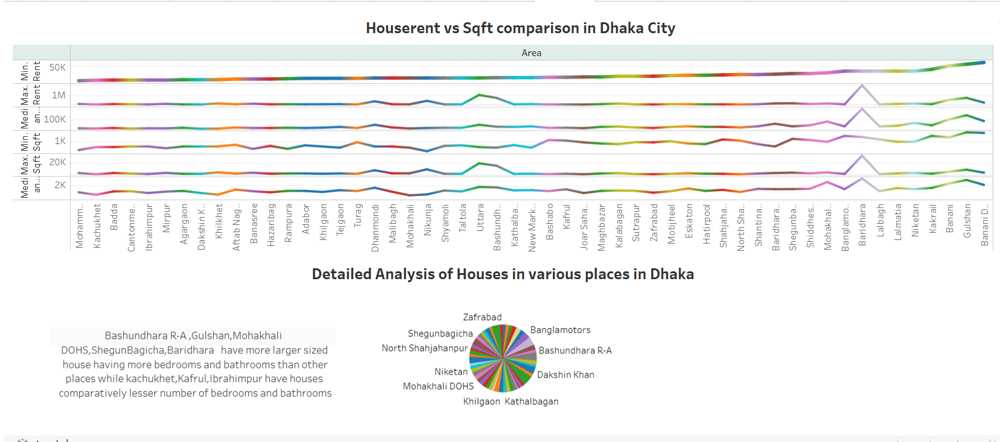
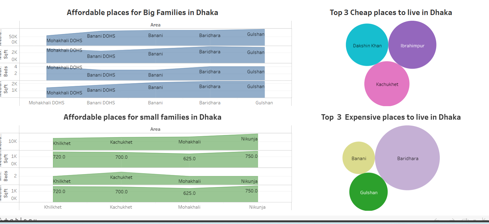
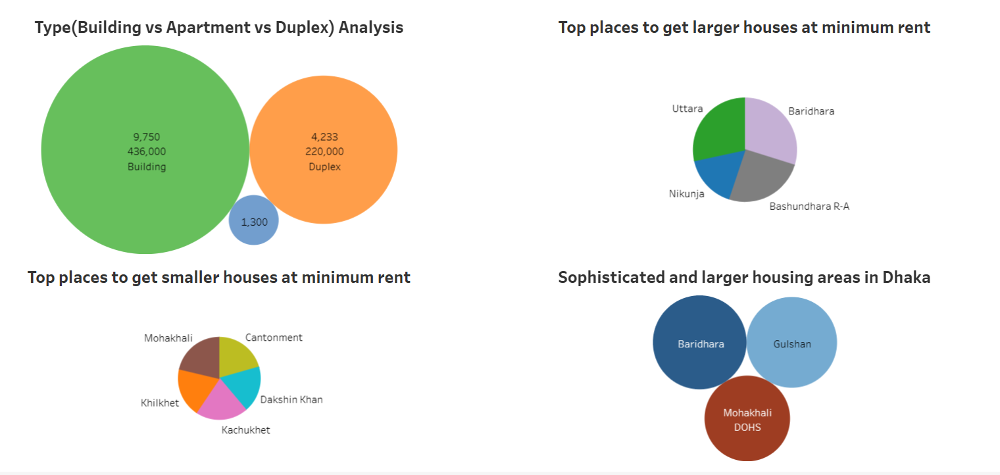
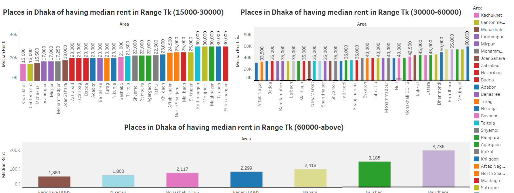
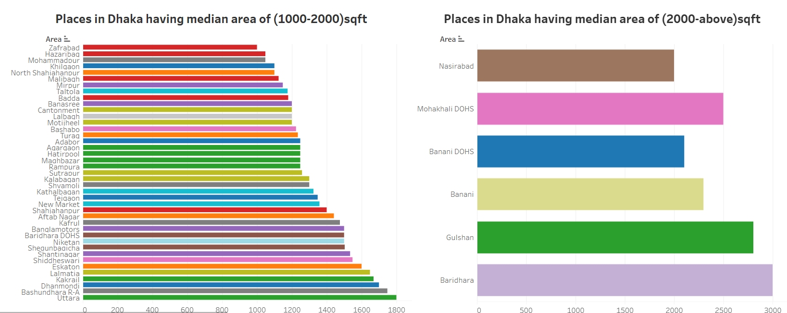
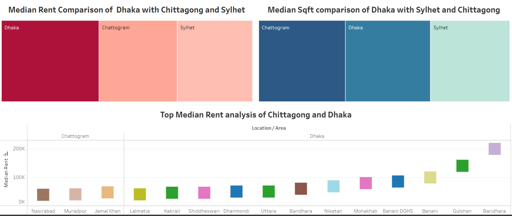

# Dhaka-City-Rent-Analysis

## Problem Statement
The main motive of this project is to have a indepth analysis of houserent of the entire Dhaka City so that it is possible to get an insight knowledge of it.
The scrapping was done from the website of a very renowned Houserenting and selling organization named "Bproperty" which is [Bproperty](https://www.bproperty.com/). The scrapped was used for providing an indepth visual analysis.Later we ultilized the scrapped data to visualize the following demographics and comparison and correlations:

#### 1. Analysis Part:

- Rent Analysis of Entire Dhaka city.
- Comparative Analysis of House Area(sqft)  in various places of Dhaka.
- Houserent vs Sqft comparison in Dhaka City.
- Detailed Analysis of Area(sqft) of Houses in various parts of Dhaka.

  <table>
  <tr>
    <td>
      
    </td>
    <td>
      
    </td>
  </tr>
</table>

#### 2. Affordibility part:

- Affordable places for smaller families to live.
- Affordable places for larger families to live.
- Top 3 cheap and expensive place to live.

  


#### 3. Top comparsion part consists of comparison of various aspects of Dhaka city




#### 4. Rent Range comparsion part consists of comparsion of rent in various ranges:
- Tk 15000-30000
- Tk 30000-60000
- Tk 60000-Above
  


#### 5. Area(sqft) Range comparsion part consists of comparsion of area(sqft) in various ranges:
- 1000-2000 sqft
- 2000-above sqft




#### 6. Last part is comparison of average rent range of Dhaka with Chittagong and Sylhet.



You can visit the public dashboard [here](//public.tableau.com/app/profile/shoaib.shahriar/viz/DhakaCityHouseRentIndepthAnalysis/DhakaVsChittagong)

##### All Findings and Observations are available [here](//public.tableau.com/app/profile/shoaib.shahriar/viz/DhakaCityHouseRentIndepthAnalysis/DhakaVsChittagong)
##### The Jupyter notebook version(ipynb) version is available[here](https://github.com/Shoaib-33/Dhaka-City-Rent-Analysis/blob/main/Dhaka_city_RentAnalysis.ipynb)
## Project Overview:

The project mainly illustrates the comparison of various aspects of Dhaka city in terms of Rent and Area.The main intention of this project is to ensure every possible visualization which is required by an individual while searching for houses in Dhaka and also to get the entire overview of the living cost of mega town Dhaka.This project is build based on deep human thoughs which must come in mind while he is searching for a house in Dhaka according to his 
capability,space requirements and other aspects. For this the project is divided into some phases in sequence to have the clear analysis of the rent in Dhaka city.The First phase is analysis which demonstates a detailed analysis of Houserent,Area(sqft),Houserent vs Area and analysis of inside view of houses like bedrooms,bathrooms etc having a clear demonstation of which place have more or less in those aspects.The second phase is affordibility phase which starts after analysis so that an individual after making the total analysis can gather knowlegde and learning those knowledge he can choose areas as per his affordability and requirements.Later part is Top comparison which will help him to understand the top places of Dhaka in various perspects.Then most important phase is the range phase which will allow him to take the final verdict of staying in place of his affordable range and housing requirements.Lastly comparison part of Average Rent of Dhaka city with mega cities like Chittagong and Sylhet will help to understand the living cost of Dhaka in respect to those cities.


## Build from Sources and run the selenium scrapper
  1.Clone the repo
  ```bash
   git clone https://github.com/Shoaib-33/Dhaka-City-Rent-Analysis.git
   ```
  2.Intialize and active virtual environment
   ```bash
   virtual --no-site-packages venv
   source venv/bin/activate
   ```
  3.Install dependencies
   ```bash
   pip install -r requirements.txt
   ```
  4.Download Crome Webdriver from https://chromedriver.chromium.org/downloads

  5.Run the scraper (Change the Webdriver Path as per the path of it in your system)
  ```bash
  python Dhaka-City-Rent-Analysis/Dhaka_City_HouseRent_Analysis.py
  ```
  6.File named "Rent_Analysis.csv" contains the entire dataset of the for the project.

  Alternatively,check out the scrapped data from [here](https://github.com/Shoaib-33/Dhaka-City-Rent-Analysis/blob/main/Rent_Analysis.csv)

  The ipynb version of the scrapping code is available [here](https://github.com/Shoaib-33/Dhaka-City-Rent-Analysis/blob/main/Dhaka_city_RentAnalysis.ipynb)

## Dashboard Sequences Order
  - Analytics
  - Analytics-II
  - Affordibility
  - Top Comparison
  - Range Comparison
  - Places(1000-2000-above)
  - Dhaka vs Chittagong
## Analytics  
Tableau Public View: 
https://public.tableau.com/app/profile/shoaib.shahriar/viz/DhakaCityHouseRentIndepthAnalysis/DhakaVsChittagong

## Project Insights

Going through the project analysis we observed that
- Average houserent is lower in Cantonment,Kachukhet,Mirpur,Mohammadpur.
- Affordable places for small families is Khilkhet,Kochukhet,Mohakhali and Nikunja considering an average houserent.
- Better place for Big families are Mohakhali DOHS,Banani DOHS,Baridhara,Gulshan
- Cheapest place to live in Dhaka are Dakkhinkhan,Ibrahimpur,Kachukhet.
- Most expensive and luxurious Living areas in Dhaka Baridhara,Gulshan,Banani.
- The House rent range comparison satisfies the above statement in the range (15000 upto more than 60k)
- The House sqft range comparison satisfies the above statement in the range (1500sqft upto more than 3k sqft)
- The Median Rent of Dhaka is much more htan median rent of two mega cities (Chittagong and Sylhet)
 
